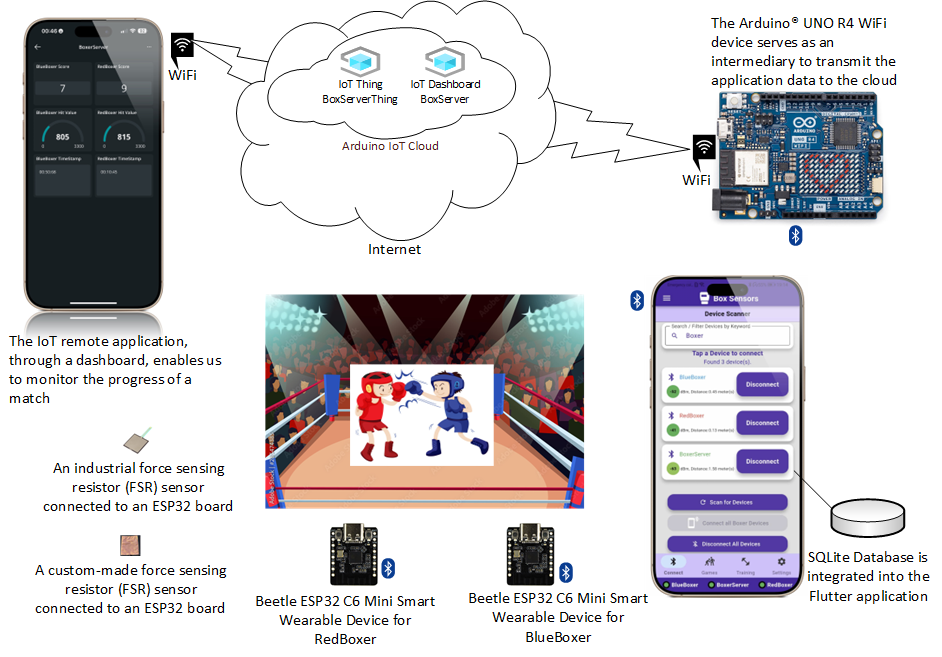

[](./README.md)
[](./README.en.md)   [🇬🇷 Ελληνικά](./README.md) | [🇬🇧 English](./README.en.md)

# Development of a System in the Field of Sports Boxing for Monitoring Punch Intensity and Count During a Match

## 📝 Project Description

This repository contains the code for the undergraduate thesis titled “Development of a system in the field of sports boxing for monitoring punch intensity and count during a match.”

The project consists of three main parts:

1. **Android Application (Flutter & Dart)**: A mobile application that displays punch data.
2. **Code for Microcontroller ESP32 Beetle C6**: Firmware running on the ESP32, which is connected to FSR (Force Sensitive Resistors) sensors to detect punches.
3. **Code for Arduino Uno R4 WiFi**: Firmware running on the Arduino Uno R4 WiFi, which receives JSON data via Bluetooth from the Android application and uploads them to Arduino Cloud over Wi-Fi.



## Practical Training in Software Topics
TOPIC: Development of a system in the field of sports boxing for monitoring punch intensity and count during a match.  
[📄 2024_ΠΕ470s (PDF)](pictures/2024_ΠΕ470.pdf) [](pictures/2024_ΠΕ470.pdf)

## 📄 Thesis Document

* Undergraduate thesis by Nikolaos Dimitrakarakos  
* Email: std083899@ac.eap.gr  
* Development of a system in the field of sports boxing for monitoring punch intensity and count during a match.  
* **English title:** Development of a System for Monitoring Punch Intensity and Count During Boxing Matches  
* The thesis is available in the university repository or at the GitHub link below.  
* Hellenic Open University (H.O.U.) Repository: Thesis  
  [](https://apothesis.eap.gr/archive/item/222407)  <a href="https://apothesis.eap.gr/archive/item/222407" target="_blank" rel="noopener noreferrer">https://apothesis.eap.gr/archive/item/222407</a>  
* Thesis PDF  
  [📄 Plh40_Ptixiaki_N_Dimitrakarakos_PE470 (PDF)](pictures/Plh40_Ptixiaki_N_Dimitrakarakos_PE470.pdf) [](pictures/Plh40_Ptixiaki_N_Dimitrakarakos_PE470.pdf)  
* Supervising professor: Ioannis Kouretas.  
* Emails: kouretas@upatras.gr, kouretas.ioannis@ac.eap.gr  
* Examination committee: Evangelos Topalis, Konstantinos Giannakopoulos.  
* Emails: topalis.evangelos@ac.eap.gr, giannakopoulos.konstantinos@ac.eap.gr

## 🤝 Contributing

This project was developed as part of an undergraduate thesis. Contributions are not being actively sought at this time.

## 📱 Android Application — Box Sensors App

The app was developed with **Flutter** and **Dart**, allowing users to monitor in real time the punch data recorded by the sensors.

<p align="center">
  <!-- App Icon -->
  
  &nbsp;&nbsp;&nbsp;
  <!-- Google Play Badge -->
  <a href="https://play.google.com/store/apps/details?id=com.sanguinarypc.box_sensors">
    
  </a>
</p>

<p align="center">
  • <strong>Google Play Store Link:</strong>
  <a href="https://play.google.com/store/apps/details?id=com.sanguinarypc.box_sensors">
    Box Sensors App
  </a>
</p>

## 🔧 Technologies Used (Android App)

<p align="center" style="line-height:0;">
  <a href="https://developer.android.com/studio"></a><a href="https://code.visualstudio.com/"></a><a href="https://flutter.dev/"></a><a href="https://flutter.dev/"></a><a href="https://dart.dev/"></a>
</p>

3. **Flutter App Setup (Box Sensors)**

* [Android Studio](https://developer.android.com/studio)  
* [Flutter](https://flutter.dev/)  
* [Dart](https://dart.dev/)  
* [Visual Studio Code](https://code.visualstudio.com/)

## 📦 Dependencies — Modules

**Technologies & Dependencies**  
<p align="left" style="line-height:0;">
  <!-- Row 1 -->
  <a href="https://pub.dev/packages/async"></a><a href="https://pub.dev/packages/flutter_riverpod"></a><a href="https://pub.dev/packages/flutter_blue_plus"></a><a href="https://pub.dev/packages/sqflite"></a><br>
  <!-- Row 2 -->
  <a href="https://pub.dev/packages/path"></a><a href="https://pub.dev/packages/path_provider"></a><a href="https://pub.dev/packages/intl"></a><a href="https://pub.dev/packages/permission_handler"></a><br>
  <!-- Row 3 -->
  <a href="https://pub.dev/packages/audioplayers"></a><a href="https://pub.dev/packages/flex_color_scheme"></a><a href="https://pub.dev/packages/uuid"></a><a href="https://pub.dev/packages/shared_preferences"></a><br>
  <!-- Row 4 -->
  <a href="https://pub.dev/packages/flutter_slidable"></a><a href="https://pub.dev/packages/gap"></a><a href="https://pub.dev/packages/animated_text_kit"></a><a href="https://pub.dev/packages/sentry_flutter"></a><br>
  <!-- Row 5 -->
  <a href="https://pub.dev/packages/package_info_plus"></a><a href="https://pub.dev/packages/file_picker"></a><a href="https://pub.dev/packages/logging"></a><a href="https://pub.dev/packages/flutter_launcher_icons"></a>
  <!-- Row 6 -->
  <a href="https://pub.dev/packages/material_color_utilities"></a>
</p>

These packages were used in the project:

- [async](https://pub.dev/packages/async) `^2.13.0`  
- [flutter_riverpod](https://pub.dev/packages/flutter_riverpod) `^2.6.1`  
- [flutter_blue_plus](https://pub.dev/packages/flutter_blue_plus) `^1.35.3`  
- [sqflite](https://pub.dev/packages/sqflite) `^2.4.2`  
- [path](https://pub.dev/packages/path) `^1.9.1`  
- [path_provider](https://pub.dev/packages/path_provider) `^2.1.5`  
- [intl](https://pub.dev/packages/intl) `^0.20.2`  
- [permission_handler](https://pub.dev/packages/permission_handler) `^12.0.0+1`  
- [audioplayers](https://pub.dev/packages/audioplayers) `^6.4.0`  
- [flex_color_scheme](https://pub.dev/packages/flex_color_scheme) `^8.2.0`  
- [uuid](https://pub.dev/packages/uuid) `^4.5.1`  
- [shared_preferences](https://pub.dev/packages/shared_preferences) `^2.5.3`  
- [flutter_slidable](https://pub.dev/packages/flutter_slidable) `^4.0.0`  
- [gap](https://pub.dev/packages/gap) `^3.0.1`  
- [animated_text_kit](https://pub.dev/packages/animated_text_kit) `^4.2.3`  
- [sentry_flutter](https://pub.dev/packages/sentry_flutter) `^8.14.2`  
- [package_info_plus](https://pub.dev/packages/package_info_plus) `^8.3.0`  
- [file_picker](https://pub.dev/packages/file_picker) `^10.1.9`  
- [logging](https://pub.dev/packages/logging) `^1.3.0`  
- [flutter_launcher_icons](https://pub.dev/packages/flutter_launcher_icons) `^0.14.3`  
- [material_color_utilities](https://pub.dev/packages/material_color_utilities) `^0.12.0`

<br>

## 🔌 ESP32 Code — ESP32 Beetle C6 (FSR Sensors)

### This firmware is designed for the ESP32 Beetle C6 microcontroller. The ESP32 is responsible for reading data from the FSR sensors mounted on boxing equipment (bag, vests) and processing and/or transmitting that data.

### Features:

* Reading values from FSR sensors.  
* Processing data to detect valid punches.  
* Communication via Bluetooth to send data to the Arduino Uno R4 WiFi from the Android BoxSensors app.

### 🛠️ Hardware:

* Microcontroller ESP32 Beetle C6: [DFRobot Beetle ESP32 C6 Info](https://wiki.dfrobot.com/SKU_DFR1117_Beetle_ESP32_C6)  
* FSR (Force Sensitive Resistors) sensors: https://cdn.sparkfun.com/assets/c/4/6/8/b/2010-10-26-DataSheet-FSR406-Layout2.pdf  
* DIY FSR sensors https://www.instructables.com/DIY-Force-Sensitive-Resistor-FSR/  
* DIY FSR sensors https://learn.bela.io/tutorials/pure-data/sensors/diy-pressure-sensor/  
* Polymer Lithium Ion Battery — 3.7 V 800 mAh

### 📚 ESP32 Libraries

- **ESP32 Arduino Core** (`esp32` by Espressif Systems)  
  Provides the runtime environment, GPIO, timers, communication peripherals, etc.  
  [ESP32 Arduino Core GitHub Repository](https://github.com/espressif/arduino-esp32)

- **BLEDevice, BLEServer, BLEUtils, BLE2902** (part of the ESP32 Arduino Core for BLE)  
  API to run ESP32-C6 as a BLE server: services, characteristics, notifications, descriptors (BLE2902), and MTU.  
  [BLE API Reference](https://docs.espressif.com/projects/arduino-esp32/en/latest/api-guides/ble.html)

- **ArduinoJson v7.4.1** (Benoit Blanchon)  
  JSON (de)serialization for forming and parsing commands over BLE.  
  [ArduinoJson on GitHub](https://github.com/bblanchon/ArduinoJson)

- **Standard C++ Libraries** (`<vector>`, `<string.h>`, etc.)  
  Basic data structures (std::vector, etc.) and C APIs.  
  [cppreference.com headers](https://en.cppreference.com/w/cpp/header)

### Custom Classes

- **BoxingApp** (`BoxingApp.h` / `BoxingApp.cpp`)  
  Central “orchestrator”: init, command handling, coordination of FSR, BLE, and timeouts.

- **BluetoothHandler** (`BluetoothHandler.h` / `BluetoothHandler.cpp`)  
  Wrapper for BLE APIs: scan/connect, service/characteristic setup, notifications & writes.

- **FSRPunchDetector** (`FSRPunchDetector.h` / `FSRPunchDetector.cpp`)  
  Debounce & threshold logic for valid punch detection from FSR sensors.

- **TimeHandler** (`TimeHandler.h` / `TimeHandler.cpp`)  
  Start/pause/reset timers for rounds, with millisecond accuracy.

- **MacDevicesConfig.h**  
  Constant MAC addresses → automatic assignment of a name (“BlueBoxer” / “RedBoxer”) at startup.

---

<br>

## ☁️ Code for Arduino Uno R4 WiFi (Bluetooth to Arduino Cloud)

This firmware targets the Arduino Uno R4 WiFi platform. Its main purpose is to receive punch data (in JSON format) via Bluetooth Low Energy (BLE) and then forward them to Arduino Cloud using the board’s Wi-Fi connection.

### Features:

* Receive JSON data via Bluetooth.  
* Connect to a Wi-Fi network.  
* Send data to Arduino Cloud.

### 🛠️ Hardware:

* Arduino Uno R4 WiFi: [Arduino Uno R4 WiFi Docs](https://docs.arduino.cc/hardware/uno-r4-wifi/)

### 📚 Arduino Uno R4 Wi-Fi Libraries

- **Arduino Core for Uno R4 Wi-Fi**  
  Runtime environment for Renesas RA4M1: GPIO, UART, SPI, I²C, timers.  
  [ArduinoCore-renesas on GitHub](https://github.com/arduino/ArduinoCore-renesas)

- **WiFi v1.9.1**  
  Support for u-blox NINA-W102: network connection, TCP/IP stack.  
  [Arduino WiFi library](https://github.com/arduino-libraries/WiFi)

- **ArduinoIoTCloud v2.5.1**  
  Sync & authentication of cloud variables, event handling.  
  [Arduino IoT Cloud library](https://github.com/arduino-libraries/ArduinoIoTCloud)

- **Arduino_ConnectionHandler**  
  Manages SSID/PASS from `arduino_secrets.h` for Wi-Fi connection.  
  [Official docs](https://docs.arduino.cc/libraries/arduino_connectionhandler/)

- **ArduinoBLE v1.4.0**  
  BLE peripheral API for Uno R4 Wi-Fi.  
  [ArduinoBLE library](https://github.com/arduino-libraries/ArduinoBLE)

- **ArduinoJson v7.4.1**  
  JSON (de)serialization for BLE ↔ Cloud variables.  
  [ArduinoJson on GitHub](https://github.com/bblanchon/ArduinoJson)

- **TimeLib v1.6.0**  
  Timestamp handling & formatting.  
  [Time library](https://github.com/PaulStoffregen/Time)

### Custom Structures

- **BluetoothHandler** (`BluetoothHandler.h` / `BluetoothHandler.cpp`)  
  BLE wrapper for ArduinoBLE, server setup & message handling.

- **JsonHandler** (inside the `.ino`)  
  Static `parseIncoming()` for mapping JSON → Cloud variables.

- **thingProperties.h**  
  Auto-generated by IoT Cloud: defines cloud variables.

- **arduino_secrets.h**  
  Contains Wi-Fi credentials (SSID & PASS).

## 📺 Check the YouTube Channel

[](https://www.youtube.com/@ΝΙΚΟΛΑΟΣ_ΔΗΜΗΤΡΑΚΑΡΑΚΟΣ)

### Tutorial Video. The information system — how the three parts of the project interact.

[](https://www.youtube.com/watch?v=TOi7IgSo4TA&t=1583s)

_Watch the video presenting the information system I created for the thesis._

<br>

### Tutorial Video. BoxSensors Application — how to use the app.

[](https://www.youtube.com/watch?v=eGz2vPkHj8w&t=21s)

_Watch the video of the BoxSensors app for Android devices that I created for the thesis._

## How to Use the Code

This document provides instructions for installing and running the software for the boxing punch monitoring system. The system consists of three main subsystems: the ESP32 Beetle C6 microcontroller for punch detection, the Arduino IoT Cloud platform for visualizing data via an Arduino Uno R4 Wi-Fi, and a Flutter application (Box Sensors) for control and data collection.

1. **ESP32 Beetle C6 Setup (BlueBoxer & RedBoxer)**  
   _The ESP32 Beetle C6 microcontrollers are responsible for collecting data from FSR sensors that detect punches. The firmware is written in C/C++._

   **Required Tools:**  
   - Arduino IDE  
   - USB Type-C cable

   **Installation Steps:**  
   1. **Install ESP32 support in Arduino IDE**  
      - Open Arduino IDE → File > Preferences  
      - In “Additional Boards Manager URLs” add  
        `https://raw.githubusercontent.com/espressif/arduino-esp32/gh-pages/package_esp32_index.json`  
      - Tools > Board > Boards Manager… → search “esp32” → install “esp32 by Espressif Systems”  
      - Tools > Board > ESP32 Arduino → select “DFRobot Beetle ESP32-C6” or similar

   2. **Upload Firmware**  
      - Navigate to your GitHub repo → folder `ESP32_Beetle_C6_FSR` → click `ESP32_Bele_C6_FSR.ino` to view or download.  
      - (Alternatively) Clone the repo:
      ```bash
      git clone https://github.com/USERNAME/REPO_NAME.git
      cd REPO_NAME/ESP32_Beetle_C6_FSR
      ```
      - You will see the classes `BoxingApp`, `FSRPunchDetector`, `TimeHandler`, `BluetoothHandler`.  
      - Open `ESP32_Beetle_C6_FSR.ino` in Arduino IDE, connect the ESP32 Beetle C6 via USB, select the correct COM port, and press **Upload**.

   **Hardware Layout:**  
   - Connect the FSR sensors to the specified analog inputs of the ESP32-C6 (e.g., GPIO 6, etc.)  
   - Power with a Li-Po 3.7 V 800 mAh battery or another stable source

---

2. **Arduino IoT Cloud Setup (BoxerServer)**  
   _The Uno R4 Wi-Fi acts as an intermediary node, receiving BLE data from Flutter and sending them to the Cloud via Wi-Fi._

   **Required Tools:**  
   - Arduino IoT Cloud account  
   - Arduino Uno R4 Wi-Fi  
   - USB cable

   **Installation Steps:**  
   1. **Create a Thing**  
      - Sign in to Arduino IoT Cloud → New Thing  
      - Define Cloud Variables (e.g., `deviceThatGotHit`, `punchScore`, `blueBoxer_punchCount`)  
      - Link the Uno R4 Wi-Fi to the Thing

   2. **Configure Wi-Fi**  
      - In the Thing’s settings: enter SSID & password (stored in `arduino_secrets.h`)

   3. **Upload Firmware**  
      - In the **Sketch** tab of the Thing: open/edit the `.ino` (Appendix A)  
      - Compile & Upload

   4. **Create a Dashboard**  
      - In Cloud: New Dashboard → add widgets and bind them to the Cloud Variables  
      - Monitor on the web or via the “IoT Remote” mobile app

   **Hardware Layout:**  
   - Power with a power bank that has a USB Type-C cable

---

3. **Flutter Application Setup (Box Sensors)**  
   _The Android app (Flutter/Dart) is the central control and data collection unit._

   **Required Tools:**  
   - Android Studio or VS Code  
   - Flutter SDK & Dart SDK  
   - Android device (e.g., Honor 10 Lite with Android 10)

   **Steps:**  
   1. Install Flutter SDK (from https://flutter.dev)  
   2. Open the project in your IDE  
   3. Run `flutter pub get` for dependencies (e.g., `flutter_riverpod`, `flutter_blue_plus`, `sqflite`, etc.)  
   4. Connect your Android device (`flutter devices`)  
   5. `flutter run`

   **App Permissions:**  
   - Location (BLE scanning): “Allow only while using the app”  
   - Ignore Battery Optimizations: “Allow”  
   - Bluetooth: required for ESP32 & Uno R4 Wi-Fi

---

**System Execution Flow**  
1. Turn on “BlueBoxer” & “RedBoxer” (ESP32-C6) → they start advertising via BLE  
2. Turn on “BoxerServer” (Uno R4 Wi-Fi) → connects to Wi-Fi & IoT Cloud, advertises BLE  
3. Open the “Box Sensors” app on your phone → connect to the three devices  
4. Configure sensitivities, rounds, durations in **Settings**  
5. Create & start a match (“Add Game” → “Start Game”)  
6. Monitor live data: ESP32 → App → Uno R4 Wi-Fi → Cloud Dashboard

_For the source code of each subsystem, navigate to the corresponding directories in this repo:_

- **ESP32 Beetle C6 FSR firmware**: [`ESP32_Beetle_C6_FSR/`](./ESP32_Beetle_C6_FSR/)  
- **Arduino IoT Cloud (Uno R4 Wi-Fi)**: [`BoxServerThing/`](./BoxServerThing/)    
- **Flutter Android app (Box Sensors)**: [`box_sensors/`](./box_sensors/)

> **Note:** Before proceeding, ensure you have installed all packages and libraries referenced in this document. Then run:

## 🚀 Run in Debug Mode

Below are the basic commands for building, running, and debugging the Flutter application:

### In the terminal (Bash / PowerShell)

### 1. Clean previous builds
```bash
flutter clean
```

### 2. Install (or update) dependencies
```bash
flutter pub get
```

### 3. Run in debug mode (default is debug). Equivalent to `flutter run --debug`
```bash
flutter run
```

## 🚀 Run in Release Mode

Below are the basic commands for building, running, and releasing the Flutter application:

### 1. Clean previous builds
```bash
flutter clean
```

### 2. Install (or update) dependencies
```bash
flutter pub get
```

### 3. Create a release APK
```bash
flutter build apk --release
```

### 4. Install the APK on the phone  
Requires the phone to be connected to a USB port of the computer.  
The phone must be in developer mode.
```bash
flutter install
```

### Folder Structure

**Simple Structure:**
```text
.
├── box_sensors/          # Flutter application code
├── ESP32_Beetle_C6_FSR/  # ESP32 firmware
├── BoxServerThing/       # Arduino Uno R4 WiFi (IoT Cloud)
└── README.md
```

Links:
- 📁 [box_sensors](./box_sensors/)
- 📁 [ESP32_Beetle_C6_FSR](./ESP32_Beetle_C6_FSR/)
- 📁 [BoxServerThing](./BoxServerThing/)
- 📄 [README.md](./README.md)

<br>
<br>

**Detailed Structure:**
```text
.
├── box_sensors/                # Flutter app (Android/iOS)
│   ├── lib/
│   │   ├── main.dart
│   │   ├── screens/            # App screens
│   │   ├── screens_widgets/    # Reusable widgets for the screens
│   │   ├── services/           # Bluetooth, SQLite, flutter_riverpod provider
│   │   ├── state/              # Timer controller
│   │   ├── Themes/             # Themes, Material Design (screen coloring)
│   │   └── widgets/            # Reusable widgets
│   ├── assets/                 # Images, icons, etc.
│   ├── pubspec.yaml
│   └── README.md               # Module-specific README for Flutter
│
├── ESP32_Beetle_C6_FSR/          # ESP32 Beetle C6 + FSR (Arduino IDE style)
│   ├── ESP32_Beetle_C6_FSR.ino   # Main ESP32 sketch (entry point)  (EBoxingGymSensors was the older name)
│   ├── BluetoothHandler.h        # BLE scanning & connection interface
│   ├── BluetoothHandler.cpp      # BLE implementation (GATT reads/writes)
│   ├── FSRPunchDetector.h        # FSR sensor “punch” detection API
│   ├── FSRPunchDetector.cpp      # Punch detection logic & debounce
│   ├── TimeHandler.h             # Timestamp & elapsed-time utility
│   ├── TimeHandler.cpp           # Time management implementation
│   ├── MacDevicesConfig.h        # Predefined MAC addresses for BLE devices
│   ├── EBoxingGymSensors.txt     # Sample CSV/JSON for data importer
│   ├── pin_configuration_n.png   # Wiring diagram (FSR → GPIO pins)  (Images must be present in the repo)
│   ├── BoxingApp.h               # Desktop app (headers for data client)  (Possibly out of ESP32 firmware scope)
│   ├── BoxingApp.cpp             # Desktop app (BLE client & JSON parser)  (Possibly out of ESP32 firmware scope)
│   └── README.md                 # ESP32-specific README
│
├── BoxServerThing/             # Arduino UNO R4 WiFi (IoT Cloud)
│   ├── BoxServerThing.ino      # Main sketch (.ino = Thing name)
│   ├── thingProperties.h       # Generated by IoT Cloud
│   ├── BluetoothHandler.h      # BLE interface (if Arduino also uses BLE)
│   ├── BluetoothHandler.cpp    # BLE implementation
│   ├── ReadMe.adoc             # Additional documentation in AsciiDoc (Optional)
│   └── README.md               # Thing-specific README
│
└── README.md                   # Main README (this file)
```

### Links (Detailed Structure): 
### box_sensors
- 📁 [box_sensors](./box_sensors/)  
- 📁 [box_sensors/lib](./box_sensors/lib/)  
- 📄 [box_sensors/lib/main.dart](./box_sensors/lib/main.dart)  
- 📁 [box_sensors/lib/screens](./box_sensors/lib/screens/)  
- 📁 [box_sensors/lib/screens_widgets](./box_sensors/lib/screens_widgets/)  
- 📁 [box_sensors/lib/services](./box_sensors/lib/services/)  
- 📁 [box_sensors/lib/state](./box_sensors/lib/state/)  
- 📁 [box_sensors/lib/Themes](./box_sensors/lib/Themes/)  
- 📁 [box_sensors/lib/widgets](./box_sensors/lib/widgets/)  
- 📁 [box_sensors/assets](./box_sensors/assets/)  
- 📄 [box_sensors/pubspec.yaml](./box_sensors/pubspec.yaml)  
- 📄 [box_sensors/README.md](./box_sensors/README.md)
     
### ESP32_Beetle_C6_FSR
- 📁 [ESP32_Beetle_C6_FSR](./ESP32_Beetle_C6_FSR/)  
- 📄 [ESP32_Beetle_C6_FSR/ESP32_Beetle_C6_FSR.ino](./ESP32_Beetle_C6_FSR/ESP32_Beetle_C6_FSR.ino)  
- 📄 [ESP32_Beetle_C6_FSR/BluetoothHandler.h](./ESP32_Beetle_C6_FSR/BluetoothHandler.h)  
- 📄 [ESP32_Beetle_C6_FSR/BluetoothHandler.cpp](./ESP32_Beetle_C6_FSR/BluetoothHandler.cpp)  
- 📄 [ESP32_Beetle_C6_FSR/FSRPunchDetector.h](./ESP32_Beetle_C6_FSR/FSRPunchDetector.h)  
- 📄 [ESP32_Beetle_C6_FSR/FSRPunchDetector.cpp](./ESP32_Beetle_C6_FSR/FSRPunchDetector.cpp)  
- 📄 [ESP32_Beetle_C6_FSR/TimeHandler.h](./ESP32_Beetle_C6_FSR/TimeHandler.h)  
- 📄 [ESP32_Beetle_C6_FSR/TimeHandler.cpp](./ESP32_Beetle_C6_FSR/TimeHandler.cpp)  
- 📄 [ESP32_Beetle_C6_FSR/MacDevicesConfig.h](./ESP32_Beetle_C6_FSR/MacDevicesConfig.h)  
- 📄 [ESP32_Beetle_C6_FSR/EBoxingGymSensors.txt](./ESP32_Beetle_C6_FSR/EBoxingGymSensors.txt)  
- 📄 [ESP32_Beetle_C6_FSR/pin_configuration_n.png](./ESP32_Beetle_C6_FSR/pin_configuration_n.png)  
- 📄 [ESP32_Beetle_C6_FSR/BoxingApp.h](./ESP32_Beetle_C6_FSR/BoxingApp.h)  
- 📄 [ESP32_Beetle_C6_FSR/BoxingApp.cpp](./ESP32_Beetle_C6_FSR/BoxingApp.cpp)  
- 📄 [ESP32_Beetle_C6_FSR/README.md](./ESP32_Beetle_C6_FSR/README.md)    

### BoxServerThing
- 📁 [BoxServerThing](./BoxServerThing/)  
- 📄 [BoxServerThing/BoxServerThing.ino](./BoxServerThing/BoxServerThing.ino)  
- 📄 [BoxServerThing/thingProperties.h](./BoxServerThing/thingProperties.h)  
- 📄 [BoxServerThing/BluetoothHandler.h](./BoxServerThing/BluetoothHandler.h)  
- 📄 [BoxServerThing/BluetoothHandler.cpp](./BoxServerThing/BluetoothHandler.cpp)  
- 📄 [BoxServerThing/ReadMe.adoc](./BoxServerThing/ReadMe.adoc)  
- 📄 [BoxServerThing/README.md](./BoxServerThing/README.md)
