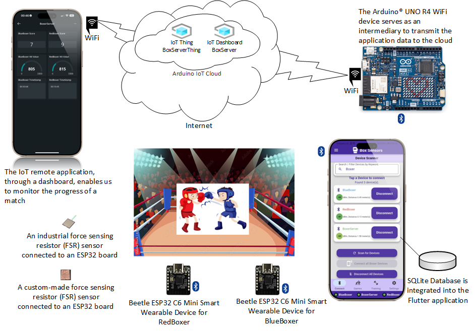

# Ανάπτυξη συστήματος στο χώρο της αθλητικής  πυγμαχίας για την παρακολούθηση της έντασης και πλήθους χτυπημάτων κατά τη διάρκεια αγώνα.

## 📝 Περιγραφή Έργου

Αυτό το αποθετήριο περιέχει τον κώδικα για την πτυχιακή εργασία με τίτλο "Ανάπτυξη συστήματος στο χώρο της αθλητικής  πυγμαχίας για την παρακολούθηση της έντασης και πλήθους χτυπημάτων κατά τη διάρκεια αγώνα."

Το έργο αποτελείται από τρία κύρια μέρη:

1.  **Εφαρμογή Android (Flutter & Dart)**: Μια mobile εφαρμογή που εμφανίζει τα δεδομένα των χτυπημάτων.
2.  **Κώδικας για Microcontroller ESP32 Beetle C6**: Κώδικας που τρέχει στον ESP32, ο οποίος είναι συνδεδεμένος με αισθητήρες FSR (Force Sensitive Resistors) για την ανίχνευση των χτυπημάτων.
3.  **Κώδικας για Arduino Uno R4 WiFi**: Κώδικας που τρέχει στο Arduino Uno R4 WiFi, το οποίο λαμβάνει δεδομένα JSON μέσω Bluetooth από την εφαρμογή Android και τα ανεβάζει στο Arduino Cloud μέσω σύνδεσης WiFi.



## Πρακτική Εξάσκηση σε θέματα Λογισμικού.
ΘΕΜΑ: Ανάπτυξη συστήματος στο χώρο της αθλητικής  πυγμαχίας για την παρακολούθηση της έντασης και πλήθους χτυπημάτων κατά τη διάρκεια αγώνα.
[📄 2024_ΠΕ470s (PDF)](pictures/2024_ΠΕ470.pdf) [](pictures/2024_ΠΕ470.pdf)

## 📄 Έγγραφο Πτυχιακής Εργασίας

Για μια πλήρη ανάλυση του σχεδιασμού, της υλοποίησης και των αποτελεσμάτων του έργου, μπορείτε να ανατρέξετε στα παρακάτω αρχεία που έχετε ήδη ανεβάσει ή σε κάποιον σύνδεσμο προς αυτά εάν τα δημοσιεύσετε:

* `Δεν έχει αναρτηθεί ακόμα η τελική έκδοση`
* Ελληνικό Ανοικτό Πανεπιστήμιο (Ε.Α.Π.) 
* Πτυχιακή εργασία του Νικόλαου Δημητρακαράκου
* Email. std083899@ac.eap.gr
 
* Ο επιβλέπων καθηγητής
* Ιωάννης Κουρέτας
* Email. kouretas@ece.upatras.gr, kouretas.ioannis@ac.eap.gr

##  🤝 Συνεισφορά

Αυτό το έργο αναπτύχθηκε στο πλαίσιο πτυχιακής εργασίας. Προς το παρόν, δεν αναζητούνται ενεργά συνεισφορές.

## 📱 Εφαρμογή Android — Box Sensors App

Η εφαρμογή αναπτύχθηκε με **Flutter** και **Dart**, και επιτρέπει στον χρήστη να παρακολουθεί σε πραγματικό χρόνο τα δεδομένα των χτυπημάτων που καταγράφουν οι αισθητήρες.

<p align="center">
  <!-- App Icon -->
  
  &nbsp;&nbsp;&nbsp;
  <!-- Google Play Badge -->
  <a href="https://play.google.com/store/apps/details?id=com.sanguinarypc.box_sensors">
    
  </a>
</p>

<p align="center">
  • <strong>Google Play Store Link:</strong>
  <a href="https://play.google.com/store/apps/details?id=com.sanguinarypc.box_sensors">
    Box Sensors App
  </a>
</p>

## 🔧 Τεχνολογίες που χρησιμοποιήθηκαν (Android App)

<p align="center" style="line-height:0;">
  <a href="https://developer.android.com/studio"></a><a href="https://code.visualstudio.com/"></a><a href="https://flutter.dev/"></a><a href="https://dart.dev/"></a>
</p>

3. **Ρύθμιση Εφαρμογής Flutter (Box Sensors)**  

* [Android Studio](https://developer.android.com/studio)
*  [Flutter](https://flutter.dev/)
* [Dart](https://dart.dev/)
* [Visual Studio Code](https://code.visualstudio.com/)

## 📦 Dependencies - Modules

**Τεχνολογίες & Dependencies**  
<p align="left" style="line-height:0;">
  <!-- 1η σειρά -->
  <a href="https://pub.dev/packages/async"></a><a href="https://pub.dev/packages/flutter_riverpod"></a><a href="https://pub.dev/packages/flutter_blue_plus"></a><a href="https://pub.dev/packages/sqflite"></a><br>
  <!-- 2η σειρά -->
  <a href="https://pub.dev/packages/path"></a><a href="https://pub.dev/packages/path_provider"></a><a href="https://pub.dev/packages/intl"></a><a href="https://pub.dev/packages/permission_handler"></a><br>
  <!-- 3η σειρά -->
  <a href="https://pub.dev/packages/audioplayers"></a><a href="https://pub.dev/packages/flex_color_scheme"></a><a href="https://pub.dev/packages/uuid"></a><a href="https://pub.dev/packages/shared_preferences"></a><br>
  <!-- 4η σειρά -->
  <a href="https://pub.dev/packages/flutter_slidable"></a><a href="https://pub.dev/packages/gap"></a><a href="https://pub.dev/packages/animated_text_kit"></a><a href="https://pub.dev/packages/sentry_flutter"></a><br>
  <!-- 5η σειρά -->
  <a href="https://pub.dev/packages/package_info_plus"></a><a href="https://pub.dev/packages/file_picker"></a><a href="https://pub.dev/packages/logging"></a><a href="https://pub.dev/packages/flutter_launcher_icons"></a>
  <!-- 6η σειρά -->
  <a href="https://pub.dev/packages/material_color_utilities"></a>
</p>


Αυτά τα πακέτα χρησιμοποιήθηκαν στο project:

- [async](https://pub.dev/packages/async) `^2.13.0`
- [flutter_riverpod](https://pub.dev/packages/flutter_riverpod) `^2.6.1`
- [flutter_blue_plus](https://pub.dev/packages/flutter_blue_plus) `^1.35.3`
- [sqflite](https://pub.dev/packages/sqflite) `^2.4.2`
- [path](https://pub.dev/packages/path) `^1.9.1`
- [path_provider](https://pub.dev/packages/path_provider) `^2.1.5`
- [intl](https://pub.dev/packages/intl) `^0.20.2`
- [permission_handler](https://pub.dev/packages/permission_handler) `^12.0.0+1`
- [audioplayers](https://pub.dev/packages/audioplayers) `^6.4.0`
- [flex_color_scheme](https://pub.dev/packages/flex_color_scheme) `^8.2.0`
- [uuid](https://pub.dev/packages/uuid) `^4.5.1`
- [shared_preferences](https://pub.dev/packages/shared_preferences) `^2.5.3`
- [flutter_slidable](https://pub.dev/packages/flutter_slidable) `^4.0.0`
- [gap](https://pub.dev/packages/gap) `^3.0.1`
- [animated_text_kit](https://pub.dev/packages/animated_text_kit) `^4.2.3`
- [sentry_flutter](https://pub.dev/packages/sentry_flutter) `^8.14.2`
- [package_info_plus](https://pub.dev/packages/package_info_plus) `^8.3.0`
- [file_picker](https://pub.dev/packages/file_picker) `^10.1.9`
- [logging](https://pub.dev/packages/logging) `^1.3.0`
- [flutter_launcher_icons](https://pub.dev/packages/flutter_launcher_icons) `^0.14.3`
- [material_color_utilities](https://pub.dev/packages/material_color_utilities) `^0.12.0`

<br>

## 🔌 ESP32 Code Κώδικας για ESP32 Beetle C6 (FSR Sensors)

###  Ο κώδικας αυτός είναι σχεδιασμένος για τον microcontroller ESP32 Beetle C6. Ο ESP32 είναι υπεύθυνος για την ανάγνωση των δεδομένων από τους αισθητήρες FSR που είναι τοποθετημένοι στον εξοπλισμό πυγμαχίας (σάκος, φανέλες) και την επεξεργασία ή/και αποστολή αυτών των δεδομένων.

### Χαρακτηριστικά:

* Ανάγνωση τιμών από αισθητήρες FSR.
* Επεξεργασία δεδομένων για την ανίχνευση έγκυρων χτυπημάτων.
* Επικοινωνία μέσω Bluetooth για την αποστολή των δεδομένων στο Arduino Uno R4 WiFi άπο την εφαρμογή Android BoxSensors.

### 🛠️ Υλικό (Hardware):

* Microcontroller ESP32 Beetle C6: [DFRobot Beetle ESP32 C6 Info](https://wiki.dfrobot.com/SKU_DFR1117_Beetle_ESP32_C6)
* Αισθητήρες FSR (Force Sensitive Resistors): https://cdn.sparkfun.com/assets/c/4/6/8/b/2010-10-26-DataSheet-FSR406-Layout2.pdf
* Αισθητήρες FSR DIY https://www.instructables.com/DIY-Force-Sensitive-Resistor-FSR/
* Αισθητήρες FSR DIY https://learn.bela.io/tutorials/pure-data/sensors/diy-pressure-sensor/
* Polymer Lithium Ion Battery - 3.7v 800mAh

### 📚 Βιβλιοθήκες ESP32

- **ESP32 Arduino Core** (`esp32` by Espressif Systems)  
  Παρέχει το runtime περιβάλλον, GPIO, timers, περιφερειακά επικοινωνίας κ.λπ.  
  [ESP32 Arduino Core GitHub Repository](https://github.com/espressif/arduino-esp32)  

- **BLEDevice, BLEServer, BLEUtils, BLE2902** (μέρος του ESP32 Arduino Core για BLE)   
  API για λειτουργία ESP32-C6 ως BLE server: services, characteristics, notifications, descriptors (BLE2902) και MTU.  
  [BLE API Reference](https://docs.espressif.com/projects/arduino-esp32/en/latest/api-guides/ble.html)

- **ArduinoJson v7.4.1** (Benoit Blanchon)  
  JSON (de)serialization για σχηματισμό και ανάλυση εντολών μέσω BLE.  
  [ArduinoJson on GitHub](https://github.com/bblanchon/ArduinoJson)  

- **Standard C++ Libraries** (`<vector>`, `<string.h>`, κ.ά.)  
  Βασικές δομές δεδομένων (std::vector κ.λπ.) και C APIs.  
  [cppreference.com headers](https://en.cppreference.com/w/cpp/header)
    

### Προσαρμοσμένες Κλάσεις

- **BoxingApp** (`BoxingApp.h` / `BoxingApp.cpp`)  
  Κεντρική «ορχήστρα»: init, διαχείριση commands, συγχρονισμός FSR, BLE και timeouts.

- **BluetoothHandler** (`BluetoothHandler.h` / `BluetoothHandler.cpp`)  
  Wrapper για BLE APIs, scan/connect, service/characteristic setup, notifications & writes.

- **FSRPunchDetector** (`FSRPunchDetector.h` / `FSRPunchDetector.cpp`)  
  Debounce & threshold logic για έγκυρη ανίχνευση «χτυπημάτων» από FSR αισθητήρες.

- **TimeHandler** (`TimeHandler.h` / `TimeHandler.cpp`)  
  Έναρξη/παύση/επαναφορά χρονομέτρων για γύρους, με ακρίβεια millisecond.

- **MacDevicesConfig.h**  
  Σταθερές MAC addresses → αυτόματη ανάθεση ονόματος (“BlueBoxer”/“RedBoxer”) στο startup.

---  

<br>

## ☁️ Κώδικας για Arduino Uno R4 WiFi (Bluetooth σε Arduino Cloud)

Ο κώδικας αυτός προορίζεται για την πλατφόρμα Arduino Uno R4 WiFi. Ο κύριος σκοπός του είναι να λαμβάνει δεδομένα χτυπημάτων (σε μορφή JSON) μέσω Bluetooth Low Energy (BLE) και στη συνέχεια να τα προωθεί στο Arduino Cloud αξιοποιώντας τη δυνατότητα σύνδεσης WiFi της πλακέτας.

### Χαρακτηριστικά:

* Λήψη δεδομένων JSON μέσω Bluetooth.
* Σύνδεση στο δίκτυο WiFi.
* Αποστολή δεδομένων στο Arduino Cloud.

### 🛠️ Υλικό (Hardware):

* Arduino Uno R4 WiFi: [Arduino Uno R4 WiFi Docs](https://docs.arduino.cc/hardware/uno-r4-wifi/)

### 📚 Βιβλιοθήκες Arduino Uno R4 Wi-Fi

- **Arduino Core for Uno R4 Wi-Fi**  
  Runtime περιβάλλον για Renesas RA4M1: GPIO, UART, SPI, I²C, timers.  
  [ArduinoCore-renesas on GitHub](https://github.com/arduino/ArduinoCore-renesas)

- **WiFi v1.9.1**  
  Υποστήριξη u-blox NINA-W102: σύνδεση στο δίκτυο, TCP/IP stack.  
  [Arduino WiFi library](https://github.com/arduino-libraries/WiFi)

- **ArduinoIoTCloud v2.5.1**  
  Sync & auth των cloud variables, event handling.  
  [Arduino IoT Cloud library](https://github.com/arduino-libraries/ArduinoIoTCloud)

- **Arduino_ConnectionHandler**  
  Διαχειρίζεται SSID/PASS από `arduino_secrets.h` για Wi-Fi σύνδεση.  
  [Official docs](https://docs.arduino.cc/libraries/arduino_connectionhandler/)
  
- **ArduinoBLE v1.4.0**  
  BLE peripheral API για UNO R4 Wi-Fi.  
  [ArduinoBLE library](https://github.com/arduino-libraries/ArduinoBLE)

- **ArduinoJson v7.4.1**  
  JSON (de)serialization για μηνύματα BLE ↔ Cloud variables.  
  [ArduinoJson on GitHub](https://github.com/bblanchon/ArduinoJson)

- **TimeLib v1.6.0**  
  Χειρισμός timestamps & formatting.  
  [Time library](https://github.com/PaulStoffregen/Time)
  

### Προσαρμοσμένες Δομές

- **BluetoothHandler** (`BluetoothHandler.h` / `BluetoothHandler.cpp`)  
  BLE wrapper για ArduinoBLE, server setup & message handling.

- **JsonHandler** (μέσα στο `.ino`)  
  Στατική `parseIncoming()` για JSON → Cloud variables.

- **thingProperties.h**  
  Αυτοματοποιημένο από IoT Cloud: ορίζει cloud variables.

- **arduino_secrets.h**  
  Περιέχει Wi-Fi credentials (SSID & PASS).  


  

## 📺 Δες το κανάλι στο YouTube

[](https://www.youtube.com/@ΝΙΚΟΛΑΟΣ_ΔΗΜΗΤΡΑΚΑΡΑΚΟΣ)


### Tutorial Video. Το πληροφοριακό συστήμα. Πώς τα τρία μέρη του έργου αλληλεπιδρούν μεταξύ τους.   

[](https://www.youtube.com/watch?v=TOi7IgSo4TA&t=1583s)

_Παρακολούθησε το βίντεο με το πληροφοριακό σύστημα που δημιούργησα για την πτυχιακή._

<br>

### Tutorial Video.   ΒoxSensors Application, πως μπορούμε να χρησιμοποιήσουμε την εφαρμογή. 

[](https://www.youtube.com/watch?v=eGz2vPkHj8w&t=21s)

_Παρακολούθησε το βίντεο με το App BoxSensors for Android Devices που δημιούργησα για την πτυχιακή._


## Πώς να Χρησιμοποιήσετε τους Κώδικες


Αυτό το έγγραφο παρέχει οδηγίες για την εγκατάσταση και εκτέλεση του λογισμικού για το σύστημα παρακολούθησης χτυπημάτων πυγμαχίας. Το σύστημα αποτελείται από τρία κύρια υποσυστήματα: τον μικροελεγκτή ESP32 Beetle C6 για την ανίχνευση χτυπημάτων, την πλατφόρμα Arduino IoT Cloud για την απεικόνιση δεδομένων μέσω ενός Arduino Uno R4 Wi-Fi, και μια εφαρμογή Flutter (Box Sensors) για τον έλεγχο και τη συλλογή δεδομένων.

1. **Ρύθμιση Μικροελεγκτή ESP32 Beetle C6 (BlueBoxer & RedBoxer)**  
   _Οι μικροελεγκτές ESP32 Beetle C6 είναι υπεύθυνοι για τη συλλογή δεδομένων από τους αισθητήρες FSR που ανιχνεύουν τα χτυπήματα. Ο κώδικας για αυτούς είναι γραμμένος σε C/C++._

   **Απαιτούμενα Εργαλεία:**  
   - Arduino IDE  
   - Καλώδιο USB Type-C

   **Βήματα Εγκατάστασης:**  
   1. **Εγκατάσταση υποστήριξης ESP32 στο Arduino IDE**  
      - Άνοιξε το Arduino IDE → File > Preferences  
      - Στο “Additional Boards Manager URLs” πρόσθεσε  
        `https://raw.githubusercontent.com/espressif/arduino-esp32/gh-pages/package_esp32_index.json`  
      - Tools > Board > Boards Manager… → αναζήτηση “esp32” → install “esp32 by Espressif Systems”  
      - Tools > Board > ESP32 Arduino → επίλεξε “DFRobot Beetle ESP32-C6” ή ανάλογη

   2. **Φόρτωση Κώδικα**  
      - Πλοηγηθείτε στο GitHub repo σας → φάκελος `ESP32_Beetle_C6_FSR` → κάντε κλικ στο `ESP32_Beetle_C6_FSR.ino` για προβολή ή λήψη.  
      - (εναλλακτικά) Κλωνοποιήστε το repo:
     ```bash
     git clone https://github.com/USERNAME/REPO_NAME.git
     cd REPO_NAME/ESP32_Beetle_C6_FSR
     ```
      - Θα δείτε τις κλάσεις `BoxingApp`, `FSRPunchDetector`, `TimeHandler`, `BluetoothHandler`.
      - Ανοίξτε το `ESP32_Beetle_C6_FSR.ino` στο Arduino IDE, συνδέστε τον ESP32 Beetle C6 μέσω USB, επιλέξτε τη σωστή θύρα COM και πατήστε **Upload**.


   **Υλική Διάταξη:**  
   - Συνδέστε τους αισθητήρες FSR στις καθορισμένες αναλογικές εισόδους του ESP32-C6 (π.χ. GPIO 6 κ.λπ.)  
   - Τροφοδοτήστε με Li-Po 3.7 V 800 mAh ή άλλη σταθερή πηγή

---

2. **Ρύθμιση Arduino IoT Cloud (BoxerServer)**  
   _Το Uno R4 Wi-Fi λειτουργεί ως ενδιάμεσος κόμβος, λαμβάνει δεδομένα BLE από το Flutter και τα στέλνει στο Cloud μέσω Wi-Fi._

   **Απαιτούμενα Εργαλεία:**  
   - Λογαριασμός Arduino IoT Cloud  
   - Arduino Uno R4 Wi-Fi  
   - Καλώδιο USB

   **Βήματα Εγκατάστασης:**  
   1. **Δημιουργία Thing**  
      - Σύνδεση στο Arduino IoT Cloud → New Thing  
      - Ορισμός Cloud Variables (π.χ. `deviceThatGotHit`, `punchScore`, `blueBoxer_punchCount`)  
      - Link του Uno R4 Wi-Fi στο Thing  

   2. **Διαμόρφωση Wi-Fi**  
      - Στις ρυθμίσεις του Thing: εισαγωγή SSID & κωδικού (αποθηκεύονται σε `arduino_secrets.h`)

   3. **Φόρτωση Κώδικα**  
      - Μέσα στην καρτέλα **Sketch** του Thing: άνοιξε/επεξεργάσου το `.ino` (Παράρτημα Α)  
      - Compile & Upload

   4. **Δημιουργία Dashboard**  
      - Στο Cloud: New Dashboard → πρόσθεσε widgets και bind με τις Cloud Variables  
      - Παρακολούθηση σε Web ή μέσω “IoT Remote” mobile app

   **Υλική Διάταξη:**  
   - Tροφοδοτήστε με ένα power bank που έχει καλώδιο για σύνδεση USB Type-C   

---

3. **Ρύθμιση Εφαρμογής Flutter (Box Sensors)**  
   _Η εφαρμογή Android (Flutter/Dart) είναι η κεντρική μονάδα ελέγχου και συλλογής δεδομένων._

   **Απαιτούμενα Εργαλεία:**  
   - Android Studio ή VS Code  
   - Flutter SDK & Dart SDK  
   - Συσκευή Android (π.χ. Honor10Lite με Android 10)

   **Βήματα Εγκατάστασης:**  
   1. Εγκατάσταση Flutter SDK (από https://flutter.dev)  
   2. Άνοιγμα project στο IDE  
   3. `flutter pub get` για dependencies (π.χ. `flutter_riverpod`, `flutter_blue_plus`, `sqflite` κ.ά.)  
   4. Σύνδεση Android συσκευής (`flutter devices`)  
   5. `flutter run`

   **Άδειες Εφαρμογής:**  
   - Location (BLE scanning): “Allow only while using the app”  
   - Ignore Battery Optimizations: “Allow”  
   - Bluetooth: απαιτείται για ESP32 & Uno R4 Wi-Fi

---

**Διαδικασία Εκτέλεσης του Συστήματος**  
1. Ενεργοποίησε “BlueBoxer” & “RedBoxer” (ESP32-C6) → αρχίζουν να διαφημίζονται μέσω BLE  
2. Ενεργοποίησε “BoxerServer” (Uno R4 Wi-Fi) → συνδέεται στο Wi-Fi & IoT Cloud, διαφημίζει BLE  
3. Άνοιξε την εφαρμογή “Box Sensors” στο κινητό → συνδέσου με τα τρία devices  
4. Ρύθμισε ευαισθησίες, γύρους, durations στο “Settings”  
5. Δημιούργησε & ξεκίνα αγώνα (“Add Game” → “Start Game”)  
6. Παρακολούθησε live δεδομένα: ESP32 → App → Uno R4 Wi-Fi → Cloud Dashboard  

_Για τον πηγαίο κώδικα κάθε υποσυστήματος, απλώς πλοηγήσου στα αντίστοιχα directories αυτού του repo:_


- **ESP32 Beetle C6 FSR firmware**: [`ESP32_Beetle_C6_FSR/`](./ESP32_Beetle_C6_FSR/)
- **Arduino IoT Cloud (Uno R4 Wi-Fi)**: [`BoxServerThing/`](./BoxServerThing/)    
- **Flutter Android app (Box Sensors)**: [`box_sensors/`](./box_sensors/)

> **Σημείωση:** Πριν προχωρήσεις, βεβαιώσου ότι έχεις εγκαταστήσει όλα τα πακέτα και τις βιβλιοθήκες που αναφέρονται σε αυτό το κείμενο. Στη συνέχεια, τρέξε:

## 🚀 Εκτέλεση & Debugging

Ακολουθούν οι βασικές εντολές για build, run και debug της Flutter εφαρμογής:

### Στο τερματικό (Bash / PowerShell)

### 1. Εκτέλεση σε debug mode (προεπιλογή είναι debug).  Ισοδυναμεί με flutter run --debug        
```bash
flutter run
```

## 🚀 Εκτέλεση σε Release Mode

### 1. Καθαρισμός προηγούμενων builds
```bash
flutter clean
```
### 2. Εγκατάσταση (ή ενημέρωση) των dependencies
```bash
flutter pub get
```
### 3. Δημιουργία release APK 
```bash
flutter build apk --release
```
### 4. Εγκατάσταση του APK στο κινητό.
Προϋποθέτει να είναι συνδεμένο το κινητό σε κάποια USB θύρα του υπολογιστή.  
Το κινητό να είναι σε developer mode.
```bash
flutter install
```


### Δομή Φακέλων

**Απλή Δομή:**
```text
.
├── box_sensors/          # Κώδικας της εφαρμογής Flutter
├── ESP32_Beetle_C6_FSR/  # Κώδικας για τον ESP32
├── BoxServerThing/       # Κώδικας για το Arduino Uno R4 WiFi (IoT Cloud)
└── README.md
```

Links:
- 📁 [box_sensors](./box_sensors/)
- 📁 [ESP32_Beetle_C6_FSR](./ESP32_Beetle_C6_FSR/)
- 📁 [BoxServerThing](./BoxServerThing/)
- 📄 [README.md](./README.md)

<br>
<br>

**Λεπτομερής Δομή:**
```text
.
├── box_sensors/                # Flutter εφαρμογή (Android/iOS)
│   ├── lib/
│   │   ├── main.dart
│   │   ├── screens/            # Οθόνες εφαρμογής
│   │   ├── screens_widgets/    # Επαναχρησιμοποιήσιμα Widgets για τις Οθόνες
│   │   ├── services/           # Bluetooth, SQLite, flutter_riverpod provider
│   │   ├── state/              # Timer controller
│   │   ├── Themes/             # Θέματα (αντί για Επαναχρησιμοποιήσιμα Widgets για τις Οθόνες)
│   │   └── widgets/            # Επαναχρησιμοποιήσιμα Widgets
│   ├── assets/                 # Εικόνες, icons κ.λπ.
│   ├── pubspec.yaml
│   └── README.md               # Ειδικό README για το Flutter module
│   
│
├── ESP32_Beetle_C6_FSR/          # ESP32 Beetle C6 + FSR (Παράδειγμα 2: Arduino IDE style)
│   ├── ESP32_Beetle_C6_FSR.ino   # Main ESP32 sketch (entry‐point)  EBoxingGymSensors was the older name.
│   ├── BluetoothHandler.h        # BLE scanning & connection interface
│   ├── BluetoothHandler.cpp      # BLE implementation (GATT reads/writes)
│   ├── FSRPunchDetector.h        # FSR sensor “punch” detection API
│   ├── FSRPunchDetector.cpp      # Punch detection logic & debounce
│   ├── TimeHandler.h             # Timestamp & elapsed‐time utility
│   ├── TimeHandler.cpp           # Time management implementation
│   ├── MacDevicesConfig.h        # Predefined MAC addresses for BLE devices
│   ├── EBoxingGymSensors.txt     # Sample CSV/JSON for data importer
│   ├── pin_configuration_n.png   # Wiring diagram (FSR → GPIO pins) - (Σημείωση: Οι εικόνες πρέπει να ανέβουν στο repo)
│   ├── BoxingApp.h               # Desktop app (headers for data client) - (Ίσως εκτός scope του ESP32 firmware)
│   ├── BoxingApp.cpp             # Desktop app (BLE client & JSON parser) - (Ίσως εκτός scope του ESP32 firmware)
│   └── README.md               # Ειδικό README για ESP32
│
├── BoxServerThing/             # Arduino UNO R4 WiFi (IoT Cloud)
│   ├── BoxServerThing.ino      # Κύριο sketch (.ino = Thing name)
│   ├── thingProperties.h       # Παραγωγμένο από IoT Cloud
│   ├── BluetoothHandler.h      # BLE interface (αν το Arduino κάνει και BLE)
│   ├── BluetoothHandler.cpp    # BLE implementation
│   ├── ReadMe.adoc             # Επιπλέον τεκμηρίωση σε AsciiDoc (Προαιρετικό)
│   └── README.md               # Ειδικό README για το Thing
│
└── README.md                   # Κύριο README (αυτό το αρχείο)
```


### Links (Λεπτομερής Δομή): 
### box_sensors
- 📁 [box_sensors](./box_sensors/)  
- 📁 [box_sensors/lib](./box_sensors/lib/)  
- 📄 [box_sensors/lib/main.dart](./box_sensors/lib/main.dart)  
- 📁 [box_sensors/lib/screens](./box_sensors/lib/screens/)  
- 📁 [box_sensors/lib/screens_widgets](./box_sensors/lib/screens_widgets/)  
- 📁 [box_sensors/lib/services](./box_sensors/lib/services/)  
- 📁 [box_sensors/lib/state](./box_sensors/lib/state/)  
- 📁 [box_sensors/lib/Themes](./box_sensors/lib/Themes/)  
- 📁 [box_sensors/lib/widgets](./box_sensors/lib/widgets/)  
- 📁 [box_sensors/assets](./box_sensors/assets/)  
- 📄 [box_sensors/pubspec.yaml](./box_sensors/pubspec.yaml)  
- 📄 [box_sensors/README.md](./box_sensors/README.md)
     
### ESP32_Beetle_C6_FSR
- 📁 [ESP32_Beetle_C6_FSR](./ESP32_Beetle_C6_FSR/)  
- 📄 [ESP32_Beetle_C6_FSR/ESP32_Beetle_C6_FSR.ino](./ESP32_Beetle_C6_FSR/ESP32_Beetle_C6_FSR.ino)  
- 📄 [ESP32_Beetle_C6_FSR/BluetoothHandler.h](./ESP32_Beetle_C6_FSR/BluetoothHandler.h)  
- 📄 [ESP32_Beetle_C6_FSR/BluetoothHandler.cpp](./ESP32_Beetle_C6_FSR/BluetoothHandler.cpp)  
- 📄 [ESP32_Beetle_C6_FSR/FSRPunchDetector.h](./ESP32_Beetle_C6_FSR/FSRPunchDetector.h)  
- 📄 [ESP32_Beetle_C6_FSR/FSRPunchDetector.cpp](./ESP32_Beetle_C6_FSR/FSRPunchDetector.cpp)  
- 📄 [ESP32_Beetle_C6_FSR/TimeHandler.h](./ESP32_Beetle_C6_FSR/TimeHandler.h)  
- 📄 [ESP32_Beetle_C6_FSR/TimeHandler.cpp](./ESP32_Beetle_C6_FSR/TimeHandler.cpp)  
- 📄 [ESP32_Beetle_C6_FSR/MacDevicesConfig.h](./ESP32_Beetle_C6_FSR/MacDevicesConfig.h)  
- 📄 [ESP32_Beetle_C6_FSR/EBoxingGymSensors.txt](./ESP32_Beetle_C6_FSR/EBoxingGymSensors.txt)  
- 📄 [ESP32_Beetle_C6_FSR/pin_configuration_n.png](./ESP32_Beetle_C6_FSR/pin_configuration_n.png)  
- 📄 [ESP32_Beetle_C6_FSR/BoxingApp.h](./ESP32_Beetle_C6_FSR/BoxingApp.h)  
- 📄 [ESP32_Beetle_C6_FSR/BoxingApp.cpp](./ESP32_Beetle_C6_FSR/BoxingApp.cpp)  
- 📄 [ESP32_Beetle_C6_FSR/README.md](./ESP32_Beetle_C6_FSR/README.md)    

### BoxServerThing
- 📁 [BoxServerThing](./BoxServerThing/)  
- 📄 [BoxServerThing/BoxServerThing.ino](./BoxServerThing/BoxServerThing.ino)  
- 📄 [BoxServerThing/thingProperties.h](./BoxServerThing/thingProperties.h)  
- 📄 [BoxServerThing/BluetoothHandler.h](./BoxServerThing/BluetoothHandler.h)  
- 📄 [BoxServerThing/BluetoothHandler.cpp](./BoxServerThing/BluetoothHandler.cpp)  
- 📄 [BoxServerThing/ReadMe.adoc](./BoxServerThing/ReadMe.adoc)  
- 📄 [BoxServerThing/README.md](./BoxServerThing/README.md)
